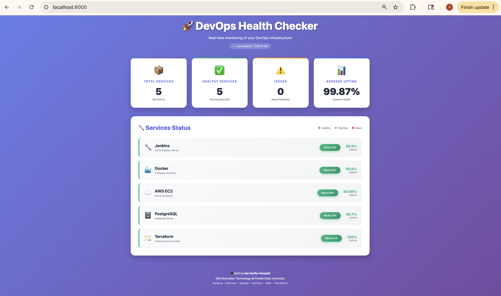

# 🚀 DevOps Health Checker

A real-time monitoring dashboard for DevOps infrastructure, built as part of an end-to-end CI/CD pipeline project.



## 📋 Project Overview

This project demonstrates modern DevOps practices by implementing a complete CI/CD pipeline with:
- Automated testing and deployment
- Containerization with Docker
- Infrastructure as Code with Terraform
- Cloud deployment on AWS
- Monitoring and logging
- Security scanning

## ✨ Features

- **Real-time Monitoring**: Live updates every 5 seconds
- **Service Health Tracking**: Monitor Jenkins, Docker, AWS, PostgreSQL, and Terraform
- **RESTful API**: Well-structured backend with multiple endpoints
- **Modern UI**: Responsive design with smooth animations
- **Auto-refresh Dashboard**: Automatic data updates without page reload

## 🛠️ Tech Stack

### Frontend
- HTML5, CSS3, JavaScript (Vanilla)
- Modern UI with gradient design and animations
- Responsive layout (mobile-friendly)

### Backend
- Node.js with Express
- RESTful API architecture
- CORS enabled for cross-origin requests

### DevOps Tools (Coming Soon)
- **CI/CD**: Jenkins
- **Containerization**: Docker, Docker Compose
- **Cloud**: AWS (EC2, RDS, VPC, ALB)
- **IaC**: Terraform
- **Artifact Management**: JFrog Artifactory
- **Monitoring**: Prometheus, Grafana
- **Logging**: CloudWatch

## 📂 Project Structure 

devops-health-checker/
├── src/
│   ├── backend/          # Node.js Express API
│   │   ├── server.js     # Main server file
│   │   └── package.json  # Dependencies
│   ├── frontend/         # Dashboard UI
│   │   ├── index.html    # Main HTML
│   │   ├── style.css     # Styles and animations
│   │   └── app.js        # Frontend logic
│   └── database/         # Database configs (coming soon)
├── docker/               # Docker configurations (coming soon)
├── terraform/            # Infrastructure as Code (coming soon)
├── jenkins/              # CI/CD pipeline (coming soon)
├── monitoring/           # Monitoring configs (coming soon)
└── tests/                # Test suites (coming soon)

## 🚀 Getting Started

### Prerequisites
- Node.js (v18 or higher)
- Python 3 (for local web server)
- Git

### Installation & Setup

1. **Clone the repository**
```bash
   git clone https://github.com/harika188/devops-health-checker.git
   cd devops-health-checker

2. Install backend dependencies

bash   cd src/backend
   npm install

3. Start the backend server

bash   npm start
Backend will run on http://localhost:3000

4. Start the frontend (in a new terminal)

bash   cd src/frontend
   python3 -m http.server 8000
Frontend will run on http://localhost:8000

5. Open your browser
Navigate to http://localhost:8000 to see the dashboard!

Example API Response
GET /api/services
json[
  {
    "id": 1,
    "name": "Jenkins",
    "status": "healthy",
    "uptime": "99.9%",
    "description": "CI/CD Pipeline Server",
    "lastCheck": "2024-10-11T14:30:00.000Z"
  }
]

🎯 Learning Outcomes
Through this project, I've gained hands-on experience with:

1.Building RESTful APIs with Node.js/Express
2.Modern frontend development with vanilla JavaScript
3.it version control and GitHub workflows
4.Project structure and organization
5.API design and documentation

Coming soon:

1.Docker containerization and orchestration
2.Infrastructure as Code with Terraform
3.CI/CD pipeline implementation with Jenkins
4.Cloud deployment on AWS
5.Monitoring and observability
6.Security best practices in DevOps

🤝 Contributing
This is a personal learning project, but feedback and suggestions are welcome!

👤 Author
Sai Harika Vempati
🎓 MS in Information Technology @ Florida State University
💼 Former Systems Engineer @ Infosys
📧 Email: saiharikachowdary00@gmail.com
💼 LinkedIn
🌐 GitHub: harika188

📄 License
This project is licensed under the MIT License.

⭐ Star this repo if you find it helpful!
📝 Follow along as I build this project week by week!

